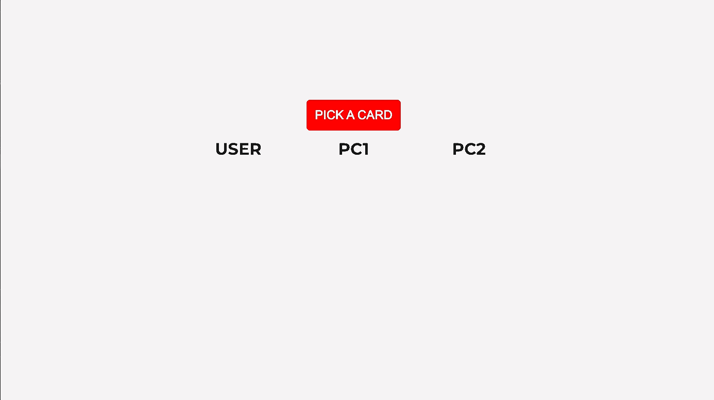

# 🃏 UNO Card Game

**Uno Card**, turn based game created with HTML, CSS, javascript, jQuery

[Play here!](https://uno-project1.vercel.app/)

  

## 🌼 Introduction

---

This is a turn based game with **2 AI** and **1 player**, which automatically changing turns. I chose this because I wanted to be able to add more advanced game features which could only be offered with at least 3 players.

  

## 🚀 Features

---

- There are 3 players, 2 AI players and you (user).
- The game will start by picking up the random cards each, and the player who has the highst number of card will be the first to play.
- Each player will be dealt 7 cards at the beginning, and as soon as one player's hand becoming empty, this player will be the **WINNER** and the game will be over.

- There are 5 special cards
  SPECIAL CARDS | METHODS
  --------------|----------
  skip | Next player forfeit turn
  reverse | Reverse the game direction
  draw 2 | Next player draws 2 cards
  wild | Current player can choose the card's color
  wild draw 4 | Same with wild card but next player draws 4 cards

  

## 🎨 Visuals

---

**Game start screen :**

**Game flow :**

**Wild card - Changing the current card's color :**

  

## Challenging part

---

Before wrting codes, I started to write down what to do and planned what methods I'm gonna use. The first challenge was :

- Setting up the data object
  - In game, I need three elements : Board, Players, Game status.
  - It was challenging to connect all three parts, so I ended up making Board object, Game status object, Players hands object
- Special Cards Methods
  - There are only 5 special cards, but since there are AI players and user, I had to make 2 different ways (functions) for each methods.
- Game flow

  - I made a function called 'gameFlow' in which there are conditions to check if current player is user or AI, which will return the function itself. This 'gameFlow' function will be recursively called, so that game is continued and players can take turns.
  - Thanks to special cards above 🃏, it was challenging to create the code path clearly for each AI and player, to execute all special functions (e.g. reverse, skip) and then return to 'gameFlow' function. (So many times, the game was played itself, even though I didn't click anything! 👻)
  - I got this idea from 'Quick Sort' Algorithm. This taught me alot how to write and use function, instead of using only 'for' loops (e.g. for, for..of, forEach)

      

## Future updates

---

- [x] Show hints : If user didn't play for 3 seconds, some hints will show up.
- [ ] Add special card which draws 1 card to each side players (left & right).
- [ ] Add options to let user choose the card color on game start page.

  

## 💻 Technologies

---

Project is created with:

- HTML
- CSS
- JAVASCRIPT : as Main Coding Language
- JQUERY with DOM

  

## Launch

---

[🏆 Play here!](https://uno-project1.vercel.app/)

  

## Author

---

Hello, I'm Oh Hyun Jung (Agnes) from South Korea 🇰🇷 based in Singapore 🇸🇬.

- [GitHub Profile](https://github.com/HyunJungOh0120)
- [Email](mailto:hyunjung.agnes.oh@gmail.com?subject=Hi% 'Hi!')

  

## Contribution

---

Sound effects obtained from <https://www.zapsplat.com>
